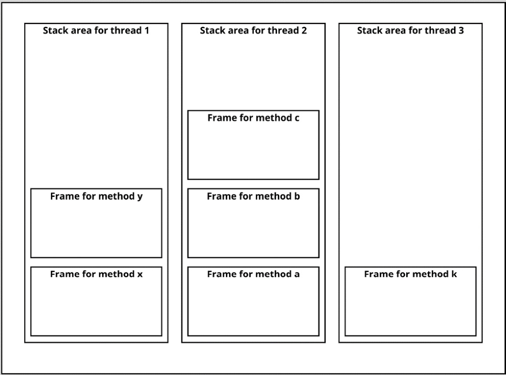
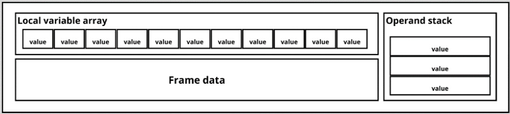

## Creating variables in Java

Creating variables in Java means that we have to declare a variable. If we also want to use it, we have to initialize it.

> _Declaration_ is the process of assigning a type and a name. _Initializing_ is about giving the variable an actual value

```
double percentage; // Declaration
percentage = 8.6 // Initializing 
```

> We can declare the variable and initialize it on the same line.
> `double percentage = 8.6`

> The JVM doesn’t check the types anymore – this is done by the compiler before running the application.

### Primitives and reference types

The JVM deals with two types of variables: primitives and reference types. There are eight primitive types in java:


| `int` | `byte` | `short` | `long` | `float` | `double` | `boolean` | `char` |
| ----- | ------ | ------- | ------ | ------- | -------- | --------- | ------ |

> The primitive types store just the value, and they are limited to eight types.

_Reference types_ are instances of classes. You can create your own classes. Therefore, there’s no real limit to how many reference types there are.

> When you create variables, there can be two types of values stored in them: _primitive values_ and _reference values_. The primitive values have the type of one of the primitives. The reference value is holding a **pointer** to an object location.

References come in four flavors:


| Class references | Array references | Interface references | `null` |
| ---------------- | ---------------- | -------------------- | ------ |

* Class reference types hold the created class objects.
* The array reference type has a component type. This is the type of the array. If the component type is not of the array type, it is called the element type.

> The array reference always has a single dimension, but the component type can be another array, creating _multi-dimensional_ arrays.

* `null` is the special case where the reference is not pointing to anything.

### How are these variables stored?

> Primitive and reference variables are stored on the _stack_. The actual object is stored on the _heap_.

### Storing variables on the stack

The stack memory is the memory that is used for executing methods.

Inside a method, primitives and references exist. Every thread in the application has its own stack. The stack consists of frames. Every method that gets invoked comes with a new frame on the stack. When the method execution is finished, the frame is removed.



> If the stack memory is too small to store what is needed for the frame, `StackOverFlowError` is thrown. When there is not enough space for a new stack for a new thread, `OutOfMemoryError` is thrown.

> The method that currently is being executed by a thread is called the **current method** and its data is held in the **current frame.**

### Elements of the frame

A frame contains a number of elements. These elements are needed to store all the necessary data for a method to be executed. A fame has a **local variable array**, an **operand stack**, and **frame data.**



#### Local variable array
* The local variables of the frame are stored in an array. 
* This array length is set during compile time.
* The array has single and double spots. 
* Single spots are for types of `int`, `short`, `char`, `float`, `byte`, `boolean`, and `reference`.
* The double spots are for `long` and `double` **(they are 64 bits in size).**

