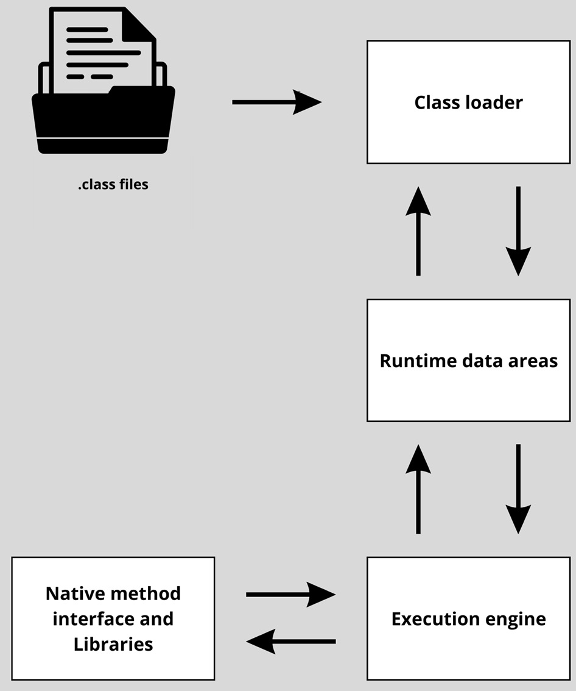
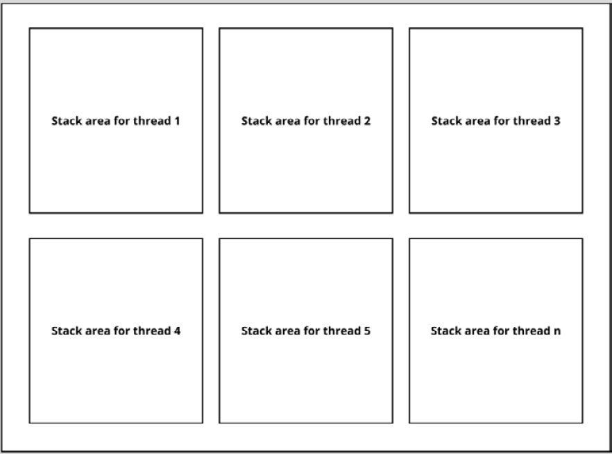
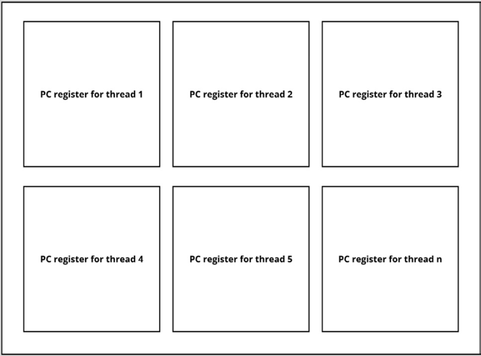

## JVM's components for memory management 
One of the tasks of the JVM is managing the Java memory. Without this memory management, no memory could be allocated and objects couldn’t be stored. Even if that part was in place, it would never be cleaned up. So, cleaning up the memory, which is also called the deallocation of objects, is of great importance for running Java code. Without it, the code can’t run, or if it’s only allocated, it will get full and the program will run out of memory.

To be able to execute applications, the JVM has roughly three components in place.

1. The **class loader**: is used to load all the classes files.
2. The **Runtime data areas** _(Java Memory)_:  is used for storing the class data, memory allocation, and the instructions that are being executed.
3. The **Execution  Engine**: is used to execute the bytecode after it's loaded in the main memory.

   

> The **Java Native Interface** interacts with the **execution engine** to use the native libraries that are required for executing the bytecode.

### Runtime data area

The memory consists of different parts:

* The Stack
* The heap
* The method area/Metaspace
* The runtime constant pool
* The program counter register
* The native method stack

#### The heap

When the JVM starts, it reserves a piece of the RAM for the Java application to use for dynamic memory allocation. This memory is called the _heap_.
This is the area where the **runtime data** is stored. **Class instances** can be found on the heap.

> The JVM takes care of assigning space to the heap and cleaning it up with a process called _garbage collection_.
> **Assigning** space is also called _allocation_ and **freeing up** this space again is also called _deallocation_.

#### The Stack (JVM Stack)

The stack is where the primitives and pointers to the heap are stored. For every method that is called, a frame gets created on a stack and this frame also holds the values for this method, such as partial results and return values.

There is not just one stack. **Every thread** in the application has its own thread.

> When an application has multiple threads, this means that multiple things are happening at the same time. This happening at the same time in an application is a very important concept called **_concurrency_**.
> This means that the stack area of the memory actually contains a lot of stacks – **_one for every thread._** The threads can only access their own stacks and the stacks cannot have links between them.

> So, the stack stores the values necessary for method execution and every thread has its own stack.

#### The Method area/Metaspace

The method area contains the _runtime code, static variables, constants pools, and constructor code._

> All threads share this method area.

#### The Program Counter (PC register)

The Program Counter (PC) register knows what code is being executed by holding the address of the instruction that is being executed in its thread. It knows the sequence of statements that needs to be executed and which one it is executing currently.

> Every thread has its own PC register

#### The native method stack (C Stack)
It is there for the native code that is executed. Native code is part of the implementation that is not written in **Java**, but for example, in **C**. These are the stacks that store the values for the native code, just as the JVM stack does for the Java code.
> Every thread has its own native method stack.
